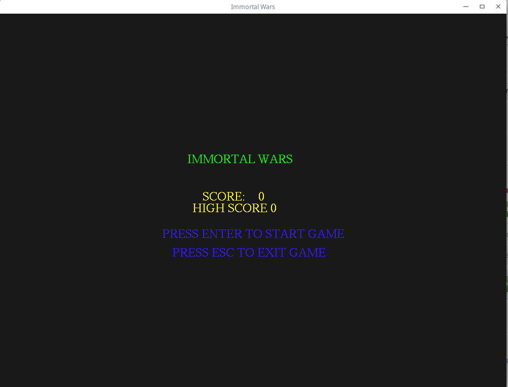
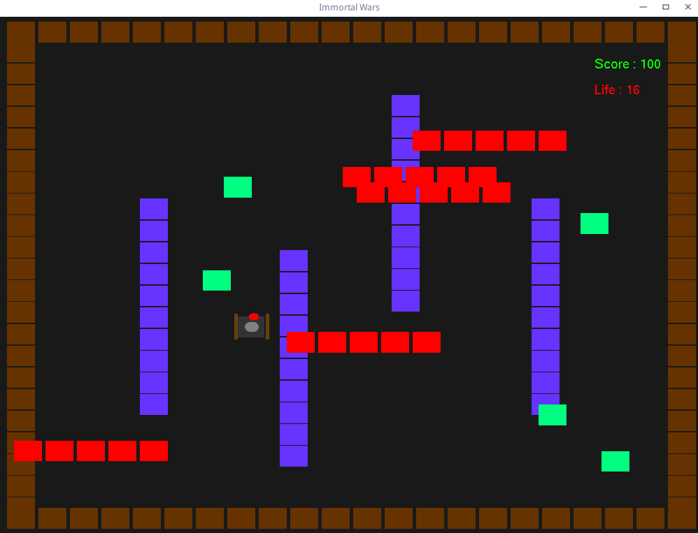

# IMMORTAL WARS GAME

OpenGL Game made during my course IGVC in IIIT-A

## Screenshots
Main Page

Gameplay Screenshot

Shoot down the Green ones to gain points
If you hit red you will loose life 
Purple ones deflect your bullets

# Prequisites

1. freeglut or OpenGL Library `sudo apt-get install freeglut3`
2. C++ `sudo apt-get install g++'

# To run

Linux Users

1. `g++ main.cpp -o gl -lGL -lGLU -lglut` 
2. `./gl`
